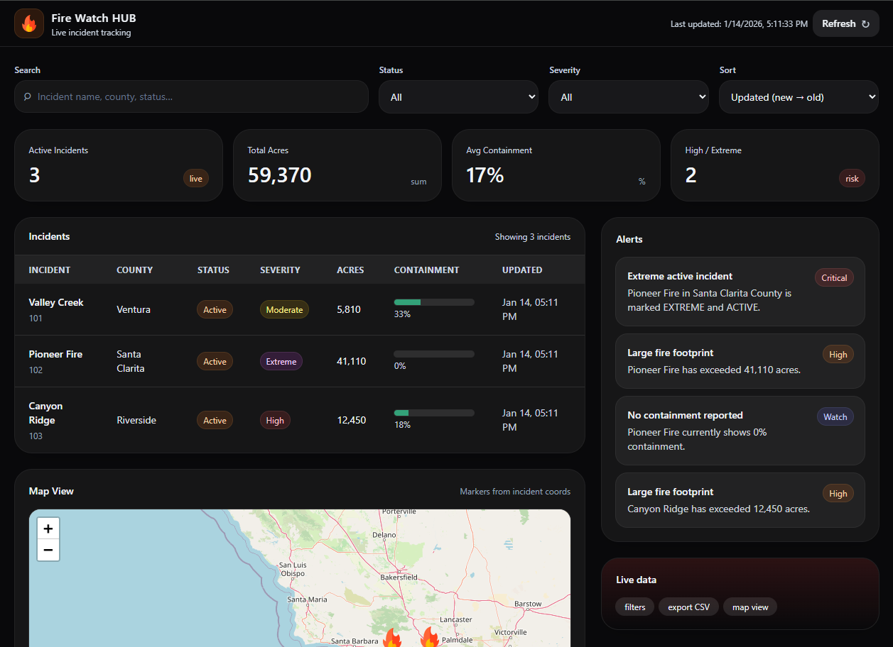

# 🔥 Fire Watch HUB | Wildfire Incident Tracker

A responsive wildfire incident dashboard that visualizes incident locations on an interactive map and provides filtering, sorting, KPI summaries, and alert logic.

Built for fast scanning and situational awareness: table + KPIs + alerts + map markers that zoom to selected incidents.

## 🚀 Live Demo
[Add your live link here]

## 🧰 Tech Stack
- **Frontend:** HTML5, JavaScript (ES6+)
- **Styling:** Tailwind CSS (CDN)
- **Mapping:** Leaflet.js + OpenStreetMap tiles
- **Live Data:** CAL FIRE Incident API (REST JSON)
- **CORS Handling:** Fetch routed through `corsproxy.io` for browser compatibility

## ✨ Features
- **Live incident fetch:** Pulls incident data from the WFIGS ArcGIS REST endpoint (when available).
- **Map view + markers:** Incidents render as custom fire markers; clicking an incident row zooms the map to that location and opens the popup.
- **Filtering & sorting:** Search by name/county/status/severity, filter by status/severity, sort by updated time/acres/containment/name.
- **KPI summaries:** Active count, total acres, average containment, high/extreme count.
- **Alert logic:** Flags large or high-risk incidents (ex: >10,000 acres or 0% containment).

## 📡 Data Flow
1. Client fetches the WFIGS FeatureServer query endpoint (ArcGIS REST).
2. Request is routed through a CORS proxy to allow browser-side retrieval.
3. Raw ArcGIS `features[].attributes` are normalized into a simplified `Incident` object.
4. UI re-renders (table, KPIs, alerts, map markers) from the shared `Incidents` state.

> **Fallback behavior:** If the live feed is unavailable or empty, the app loads a small set of local fallback incidents so the UI remains usable for testing and portfolio display.
